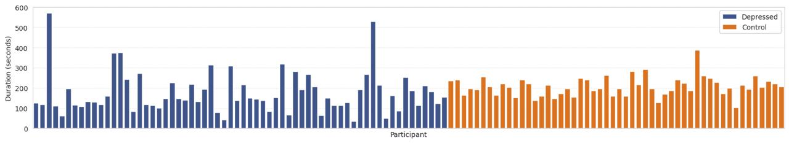
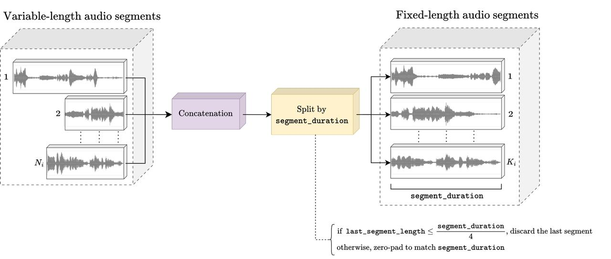
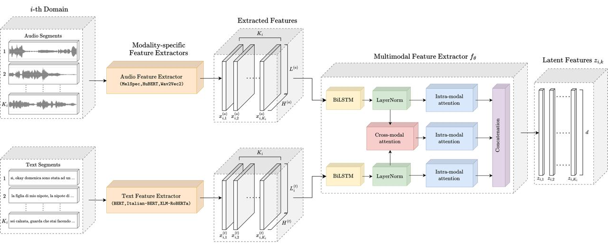
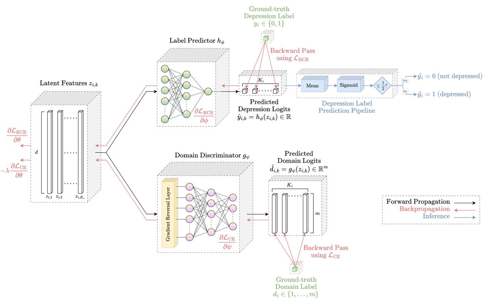
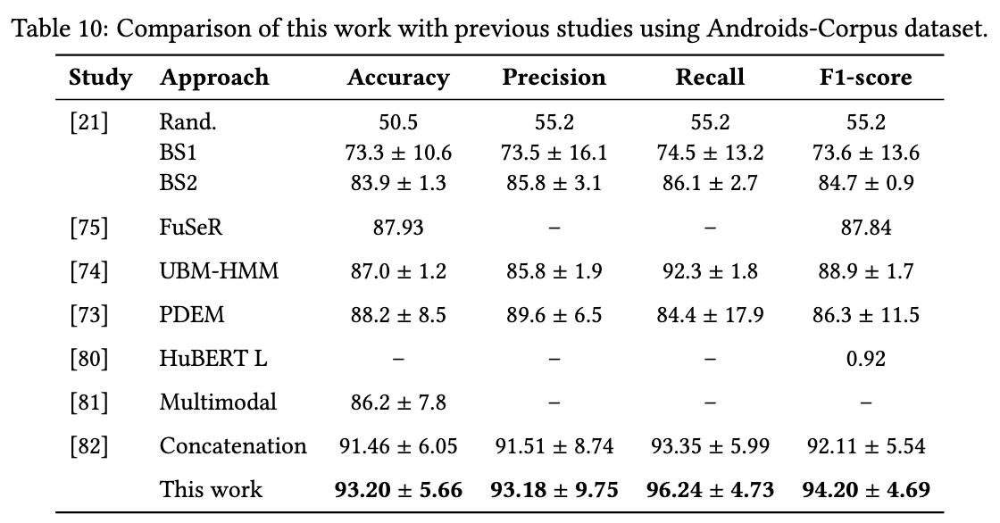
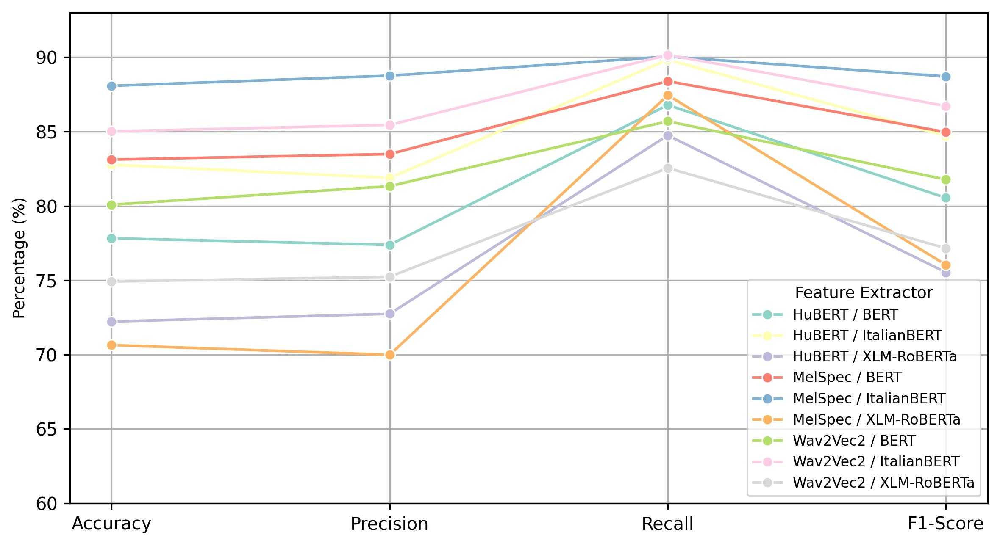
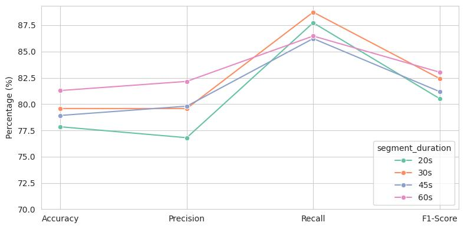

## Domain Generalization for Multimodal Audio-textual Depression Detection


### Abstract

Despite growing interest in multimodal deep learning for automatic depression detection, many existing approaches fail to generalize in real-world clinical settings due to variability across individuals—a challenge commonly known as _domain shift_. This study is the first to integrate domain generalization (DG) into a multimodal depression detection pipeline, aiming to enhance robustness and generalizability while addressing a critical gap in the existing literature.

The proposed framework detects depression by leveraging both acoustic and textual features, incorporating a _bidirectional Long Short-Term Memory (BiLSTM)_ network for each modality, followed by attention mechanisms and segment-level decision-making. To enable domain generalization, the _Domain-Adversarial Training of Neural Networks (DANN)_ methodology is used, which promotes the learning of domain-invariant features by adversarially reducing the model's ability to distinguish between individual speakers, thereby mitigating subject-specific biases.

Experiments were conducted on the Italian-language _Androids-Corpus_ dataset using a 5-fold cross-validation protocol, with strict separation between training, validation, and test sets. A range of audio (`MelSpec`, `HuBERT`, `Wav2Vec2`) and text (`BERT`, `Italian-BERT`, `XLM-RoBERTa`) feature extractor combinations were evaluated across segment durations of 20, 30, 45, and 60 seconds. The pairing of `MelSpec` with `Italian-BERT` at a 30-second segment length emerged as the optimal configuration and was selected as the baseline for DG integration.

Adopting domain generalization led to a 2.8% increase in accuracy, delivering final performance of **93.20% accuracy**, **93.18% precision**, **96.24% recall**, and **94.20% F1-score**, surpassing all existing benchmarks on the dataset. Furthermore, the complementary strengths of multimodal fusion and deep learning design choices were validated through extensive ablation studies, confirming the effectiveness of DG in improving generalization in multimodal audio-textual depression detection.


### Project Gallery

| Distribution of Waveform Durations |
| ----- |
|  |

| Preprocessing |
| ----- |
|  |

| Feature Extraction Pipeline |
| ----- |
|  |

| Adversarial Learning |
| ----- |
|  |

| Results Compared to the Literature |
| ----- |
|  |

| Avg. Performance of Feature Extractors | Avg. Performance of Segment Durations |
| --- | --- |
|  |  |


### Installation

All experiments were carried out on a server featuring two _NVIDIA TITAN V_ GPUs (each providing 12 GB of VRAM and running CUDA version 12.8). The environment was set up using `Conda`, with Python version _3.12.8_, allowing automatic management of all library dependencies. The project’s core is implemented in `PyTorch` for building deep learning models, while Hugging Face’s `Transformers` and `Datasets` libraries are employed for utilizing pre-trained models and processing audio transcriptions. The machine learning pipeline and evaluation metrics are supported by `Scikit-learn`. Additional tools such as `librosa`, `pandas`, `NumPy`, and `Seaborn` are used for data processing, analysis, and visualization tasks.

The complete set of dependencies can be installed easily with the following commands:

```shell
conda create --name thesis python=3.12.8
conda activate thesis
pip install -r requirements.txt
```

### Running the Project

The `main.py` script provides a command-line interface (CLI) for running experiments on the _Androids_Corpus_ dataset. It supports flexible configuration of modalities, feature extractors, and experimental setups. You can execute **individual experiments** or run **all combinations** of audio and text feature extractors across different segment durations. The system supports running _with_ or _without_ domain generalization.

```yaml
python3 main.py [OPTIONS] [TASK]

Key [OPTIONS]:
├── –dataset (REQUIRED)           # Dataset to use {“Androids_Corpus”}
├── –modality (REQUIRED)          # Input modality {“audio”, “text”, “multimodal”}
├── –device (REQUIRED)            # Target device {“cpu”, “cuda:0”, “cuda:1”}
├── –generalization               # Optional flag to enable domain generalization

Key [TASK]:
├── –all_experiments              # Run all predefined experiments
├── –experiment                   # Run a specific experiment by name
```

1. To run all experiments at once, simply run:
```bash
python3 main.py --all_experiments --dataset "Androids_Corpus" --modality "multimodal" --device "cuda:0"
```

2. To run a specific experiment, simply specify the name of the experiment as `{audio_vectorizer}_{text_vectorizer}_{segment_duration}`, where:
   - `audio_vectorizer`:  {MelSpec, HuBERT, Wav2Vec2}
   - `text_vectorizer`: {BERT, ItalianBERT, XLMRoBERTa}
   - `segment_duration`: {20, 30, 45, 60}
```bash
python3 main.py --experiment "MelSpec_ItalianBERT_30" --dataset "Androids_Corpus" --modality "multimodal" --device "cuda:0"
```

Add the `--generalization` flag at the end of any command to enable domain generalization.


> [!IMPORTANT]
> Before running the project, modify the `.env` file, updating `PROJECT_ROOT_PATH` with the correct absolute path to the project directory.
> To prepare the TensorBoard for a given experiment (e.g., `AC30_Wav_ITB_multimodal`):
> - Check the status of previous TensorBoards on Linux, run `ps aux | grep tensorboard`
> - Run `tensorboard --logdir "runs/Androids_Corpus_30s/Wav2Vec2_ItalianBERT/multimodal" --port 6010`
> - Access the TensorBoard on `http://localhost:6010/`

> [!TIP]
> Mapping a remote execution to local server can be achieved by `ssh -L 6010:localhost:6010 USER@SERVER_ADDRESS`

### Project Structure

```yaml
multimodal-depression-detection/
├── data/                         # Contains the raw and processed data files
│   ├── processed/                # Processed cached feature embeddings
│   ├── raw/                      # Raw datasets before processing
├── images/                       # Includes the images visualizing the model and results
├── logs/                         # Training logs (loss, metrics, lr, execution time)
├── runs/                         # Stores the tensorboard workers for further access
├── src/                          # Contains the main project scripts
│   ├── dataset_downloader.py     # Script to download the DAIC-WoZ & Androids-Corpus datasets
│   ├── dataset_loader.py         # Loads and preprocesses datasets for training
│   ├── feature_extractor.py      # Provides modules for audio & text feature exctraction
│   ├── model.py                  # Defines the multimodal BiLSTM-based model architecture
│   ├── training.py               # Training & evaluation pipeline (loss, optimizer, logging)
│   ├── visualize.py              # Scripts for visualizing model results & metrics
├── .env                          # Environment variables (API keys, paths, etc.)
├── .gitignore                    # Files & directories to ignore in version control
├── LICENSE                       # License information for the project
├── README.md                     # Project overview, setup instructions, and usage details
├── main.py                       # main code block to run from the command-line
├── playground.ipynb              # Jupyter notebook for quick experiments & visualization
├── requirements.txt              # List of dependencies for installation
```
